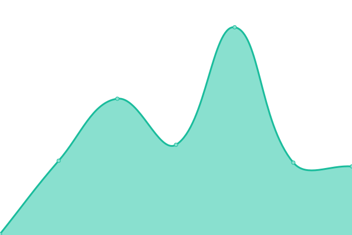

# [📈 Live Status](https://rhpcs-mcmaster.github.io/downtime): <!--live status--> **🟧 Partial outage**

This repository contains the open-source uptime monitor and status page for [rhpcs-mcmaster](https://rhpcs-mcmaster.github.io/downtime), powered by [Upptime](https://github.com/upptime/upptime).

With [Upptime](https://upptime.js.org), you can get your own unlimited and free uptime monitor and status page, powered entirely by a GitHub repository. We use [Issues](https://github.com/rhpcs-mcmaster/downtime/issues) as incident reports, [Actions](https://github.com/rhpcs-mcmaster/downtime/actions) as uptime monitors, and [Pages](https://rhpcs-mcmaster.github.io/downtime) for the status page.

<!--start: status pages-->
<!-- This summary is generated by Upptime (https://github.com/upptime/upptime) -->
<!-- Do not edit this manually, your changes will be overwritten -->
<!-- prettier-ignore -->
| URL | Status | History | Response Time | Uptime |
| --- | ------ | ------- | ------------- | ------ |
|  [MACENGAGED](https://www.macengaged.com/) | 🟥 Down | [macengaged.yml](https://github.com/rhpcs-mcmaster/downtime/commits/HEAD/history/macengaged.yml) | 

 0ms
     
 | 

<a href="https://rhpcs-mcmaster.github.io/downtime/history/macengaged">0.00%</a>
    

|  [eMuseum](https://emuseum.mcmaster.ca/) | 🟩 Up | [e-museum.yml](https://github.com/rhpcs-mcmaster/downtime/commits/HEAD/history/e-museum.yml) | 

 688ms
     
 | 

<a href="https://rhpcs-mcmaster.github.io/downtime/history/e-museum">100.00%</a>
    

|  [MMOS](https://museum.mcmaster.ca) | 🟩 Up | [mmos.yml](https://github.com/rhpcs-mcmaster/downtime/commits/HEAD/history/mmos.yml) | 

 610ms
     
 | 

<a href="https://rhpcs-mcmaster.github.io/downtime/history/mmos">100.00%</a>
    

|  [arieal.mcmaster.ca](https://arieal.mcmaster.ca) | 🟩 Up | [arieal-mcmaster-ca.yml](https://github.com/rhpcs-mcmaster/downtime/commits/HEAD/history/arieal-mcmaster-ca.yml) | 

 2563ms
     
 | 

<a href="https://rhpcs-mcmaster.github.io/downtime/history/arieal-mcmaster-ca">100.00%</a>
    

|  [Back2Play](https://b2p.mcmaster.ca/api/surveys) | 🟩 Up | [back2-play.yml](https://github.com/rhpcs-mcmaster/downtime/commits/HEAD/history/back2-play.yml) | 

 244ms
     
 | 

<a href="https://rhpcs-mcmaster.github.io/downtime/history/back2-play">100.00%</a>
    

|  [ms.math.mcmaster.ca](http://ms.math.mcmaster.ca/uptimerobot) | 🟩 Up | [ms-math-mcmaster-ca.yml](https://github.com/rhpcs-mcmaster/downtime/commits/HEAD/history/ms-math-mcmaster-ca.yml) | 

 212ms
     
 | 

<a href="https://rhpcs-mcmaster.github.io/downtime/history/ms-math-mcmaster-ca">100.00%</a>
    

|  [rhpcs.mcmaster.ca](http://rhpcs.mcmaster.ca) | 🟩 Up | [rhpcs-mcmaster-ca.yml](https://github.com/rhpcs-mcmaster/downtime/commits/HEAD/history/rhpcs-mcmaster-ca.yml) | 

 2748ms
     
 | 

<a href="https://rhpcs-mcmaster.github.io/downtime/history/rhpcs-mcmaster-ca">100.00%</a>
    

|  [web.mcmaster.ca](http://web.mcmaster.ca/.well-known) | 🟩 Up | [web-mcmaster-ca.yml](https://github.com/rhpcs-mcmaster/downtime/commits/HEAD/history/web-mcmaster-ca.yml) | 

 189ms
     
 | 

<a href="https://rhpcs-mcmaster.github.io/downtime/history/web-mcmaster-ca">100.00%</a>
    

|  [WebMail](https://web.mcmaster.ca/mail/roundcube/1.4/) | 🟩 Up | [web-mail.yml](https://github.com/rhpcs-mcmaster/downtime/commits/HEAD/history/web-mail.yml) | 

 208ms
     
 | 

<a href="https://rhpcs-mcmaster.github.io/downtime/history/web-mail">100.00%</a>
    

|  [McMaster Research and Innovation](https://research.mcmaster.ca) | 🟩 Up | [mc-master-research-and-innovation.yml](https://github.com/rhpcs-mcmaster/downtime/commits/HEAD/history/mc-master-research-and-innovation.yml) | 

 2210ms
     
 | 

<a href="https://rhpcs-mcmaster.github.io/downtime/history/mc-master-research-and-innovation">100.00%</a>
    

|  Test hidden tcp ping for ssh | 🟩 Up | [test-hidden-tcp-ping-for-ssh.yml](https://github.com/rhpcs-mcmaster/downtime/commits/HEAD/history/test-hidden-tcp-ping-for-ssh.yml) | 

 84ms
     
 | 

<a href="https://rhpcs-mcmaster.github.io/downtime/history/test-hidden-tcp-ping-for-ssh">100.00%</a>
    

<!--end: status pages-->

[**Visit our status website →**](https://rhpcs-mcmaster.github.io/downtime)

## 📄 License

- Powered by: [Upptime](https://github.com/upptime/upptime)
- Code: [MIT](./LICENSE) © [rhpcs-mcmaster](https://rhpcs-mcmaster.github.io/downtime)
- Data in the `./history` directory: [Open Database License](https://opendatacommons.org/licenses/odbl/1-0/)
